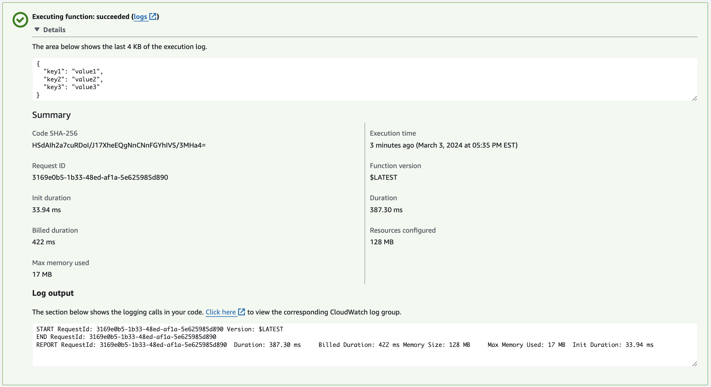
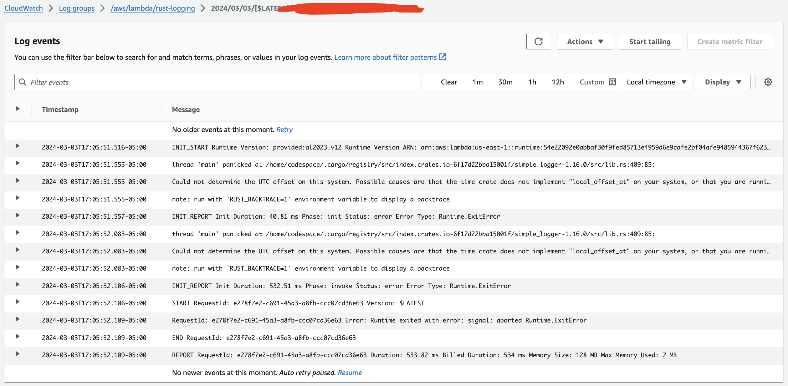

# AWS Lambda Rust Function: Lambda Logging
By Daniel Medina

## Function Overview

This AWS Lambda function is implemented in Rust and designed for [insert your function's purpose here, e.g., "processing JSON input and performing a specific task based on the content"]. It leverages AWS services for logging, monitoring, and tracing to ensure high reliability and maintainability.

### Features

- **Logging Implementation**: Utilizes Rust's `log` crate for structured logging.
- **X-Ray Tracing**: Integrates with AWS X-Ray for detailed tracing of the function execution path.
- **CloudWatch Centralization**: Centralizes logs and metrics in AWS CloudWatch for easy access and analysis.

## Logging Implementation

The function uses the `env_logger` crate to handle logging. This choice ensures compatibility with AWS Lambda's execution environment, circumventing issues related to timezone configurations that can arise with other logging implementations.

Logs generated by the function, including informational messages and errors, are automatically forwarded to Amazon CloudWatch Logs, enabling real-time monitoring of the function's behavior and performance.

To adjust the logging level, set the `RUST_LOG` environment variable in the Lambda configuration to one of the following: `error`, `warn`, `info`, `debug`, or `trace`.

## X-Ray Tracing

AWS X-Ray tracing is enabled to provide insights into the function's execution and performance characteristics. This feature allows for the visualization of the function's call graph, helping to diagnose latency issues and errors.

To utilize X-Ray tracing, make sure that:
1. The AWS X-Ray SDK for Rust is properly integrated.
2. The Lambda function's execution role has the necessary permissions to write trace data to AWS X-Ray.
3. X-Ray tracing is enabled in the AWS Lambda console for this function.

## CloudWatch Centralization

All logs generated by this function, along with metrics and traces, are centralized in AWS CloudWatch. This centralization facilitates the monitoring of the function's execution, allowing for the setting of alarms based on specific metrics or log patterns and ensuring that administrators are promptly alerted to any issues.

### Viewing Logs

To view the function's logs, navigate to the CloudWatch service in the AWS Management Console, and select `Logs` > `Log groups`. Find the log group named `/aws/lambda/<function-name>`.

### Monitoring Metrics

CloudWatch metrics for this function, including invocation counts, errors, duration, and throttling, can be found under the `Metrics` tab in the CloudWatch service. Navigate to the `AWS/Lambda` namespace and filter by the function name.

---

For more information on configuring and deploying this AWS Lambda function, refer to the [AWS Lambda Developer Guide](https://docs.aws.amazon.com/lambda/latest/dg/welcome.html) and the [AWS SDK for Rust documentation](https://docs.aws.amazon.com/sdk-for-rust/latest/dg/welcome.html).